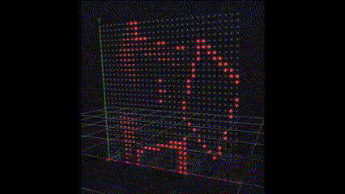

## Chromatik GST

This is a Chromatik package that provides a simple integration of the cross-platform [GStreamer](https://gstreamer.freedesktop.org/) library for audio and video processing.
GStreamer has the ability to perform hardware accelerated video decoding on various platforms.  Also, for CUDA-based systems, NVIDIA provides GStreamer pipeline components for
hardware accelerated machine learning inference so it is possible for example to split the pipeline where one video sink (destination) is used for display
and the other is used for pose detection, etc.

### Installation
- Download the latest release from the [releases page](https://github.com/tracyscott/ChromatikGST/releases)
- Install GStreamer 1.24.12 from the [official website](https://gstreamer.freedesktop.org/download/)
- Other versions might work but I have only tested with 1.24.12
- Make sure GStreamer binaries are in your system PATH on Windows. On Mac OS X, you will need them in your path to run the command-line tools, which is VERY HIGHLY recommended for debugging. 
- On Mac OS X, the GStreamer library must be installed in the `/Volumes/Macintosh HD/System/Volumes/Data/Library/Frameworks/GStreamer.framework/Versions/1.0` directory.  Currently the ChromatikGST plugin adds that install directory to the jna.library.path property during static initialization.  If you installed differently, for example through homebrew (not recommended) then you will need to add the appropriate -Djna.library.path=whatever to the execution of your Chromatik java process through Chromatik.cfg if you are using a Mac application bundle or Chromatik.command if you are using a command-line build.
- For Windows, I added `C:\gstreamer\1.0\msvc_x86_64\bin` to the PATH on a default GStreamer install.
- For Mac OS X, I added `/Volumes/Macintosh HD/System/Volumes/Data/Library/Frameworks/GStreamer.framework/Versions/1.0/bin` to the `/etc/paths` file via:
- `sudo nano /etc/paths`
- Also for Mac OS X, you should remove the hardware accelerated video decoder from the GStreamer pipeline.  It has been a little glitchy in my experience so unless you absolutely need hardware accelerated decoding I would avoid it, especially if you have odd video dimensions or weird encodings. For GStreamer plugins it is listed as Bad for the Good, Bad, and Ugly classification which means less supported.  With it removed, GStreamer will use libav, which is from ffmpeg and probably much more stable.
- `sudo rm /Volumes/Macintosh HD/System/Volumes/Data/Library/Frameworks/GStreamer.framework/Versions/1.0/lib/gstreamer-1.0/libgstapplemedia.dylib`
- The following command should pop up your webcam in window:
- `gst-launch-1.0 autovideosrc ! autovideosink`
- Drag and drop the JAR file into the Chromatik UI to install the package.

### Building

- Build with `mvn package`
- Install via `mvn install`

_Note that `mvn install` does **not** automatically copy static files from [`src/main/resources`](src/main/resources) into your root `~/Chromatik` folder. You can either perform this step manually, or by importing the package using the Chromatik UI._

### Patterns
These patterns should only be used on Grid fixtures that are selected for a channel with the channel's Model View Selector option.  The pattern attempts to auto-compute fixture-local UV coordinates for the video but there still is a bug anytime there is a pitch angle.  When normalizing coordinates in a user-defined view, the coordinates are still in world space with the included fixture rotations so we have to try to infer the normal plane and reverse the rotations.
#### GSTVideo
- Plays videos from ~/Chromatik/Video/. The sync option will restart the video each time the pattern becomes active.  Specifically, it resets the play position to the head of the stream whenever the pattern becomes inactive in order to give GStreamer time to reset the pipeline.  With a pattern play time of 500ms per video I have noticed timeline glitching.  One second pattern lengths seem fine.

#### GSTTestSrc
- This uses the videotestsrc plugin to generate a test video.  This is the simplest test

#### GSTAutoVideo
- Equivalent to autovideosrc in GStreamer. Automatically selects the best video source available, which should be a webcam or the videotestsrc if none available.  Currently not working on Mac OS X which I think might be related to app permissions to the webcam.  It will require some lower level apple permissions hacking if you need to do it.

### Video Generation
Included in this repository is an example Processing sketch that renders some frames and then utilizes ffmpeg to encode a video.  You will need ffmpeg installed and in your path.  The script is designed for an installation that has dimensions of 4 x 468 pixels so it implements some extra steps for scaling up the rendering before showing it on a monitor.  You will need to change the sketch to change the dimensions or other video properties, such as whether the encoding is lossless (the current default) or lossy.

### TODO
- Directly support Grid fixtures in the patterns to simplify UV coordinate generation and to bypass rotation issues.
- Allow for arbitrary pipeline creation with text based pipeline description. [GST Plugins](https://gstreamer.freedesktop.org/documentation/plugins_doc.html?gi-language=c)

### Caveats
- Occasionally on Windows, the Chromatik window will close but the process will zombie. On Windows, you may need to use the task manager to manually kill it. Not yet able to reliably reproduce this issue but it is probably a GStreamer thread not being properly interrupted/exited while disposing patterns.  You will notice the issue when running 'mvn install' on a build because the zombie process will still have the JAR open in ~/Chromatik/Packages.
- This hasn't been tested on a real installation yet.  It seems stable running for days but use with caution.  
- The GStreamer decoding pipeline is implemented in C and accessed via Java's JNA.  If something goes wrong in the C code, the entire process might exit.  Although, a decent number of errors are caught and just the single pipeline/pattern will quit working.
- The GStreamer pipeline is interacted with asynchronously and in a multi-threaded fashion.  In general I have noticed it doesn't like to be tickled too fast.  For example, the width and height knobs will set properties on the pipeline so that the videoscaler node does the scaling efficiently in C code but if you update them quickly I've noticed the pipeline can get in an unpleasant state.
- There are still some issues with fixture rotations depending on if the points are in a View or just being addressed without views.